## Automold

**There are various types of image augmentations done to increase the image corpus for training neural networks. However for training CNNs to drive some special road conditions are required. These can be random gravels of the road or maybe snow. Rain and fog also reduce the visibility to a great extent. Automold helps in addressing these challenges and augments road images to have various weather and road conditions.**


### Importing road augmentation library Automold and helper functions library


```python
import Automold as am
import Helpers as hp
```

#### Let's load up some images first


```python
path='./test_augmentation/*.jpg'
images= hp.load_images(path)
```

#### visualize function helps in displaying images easily without requiring you to write the whole code.


```python
hp.visualize(images, column=3, fig_size=(20,10))
```


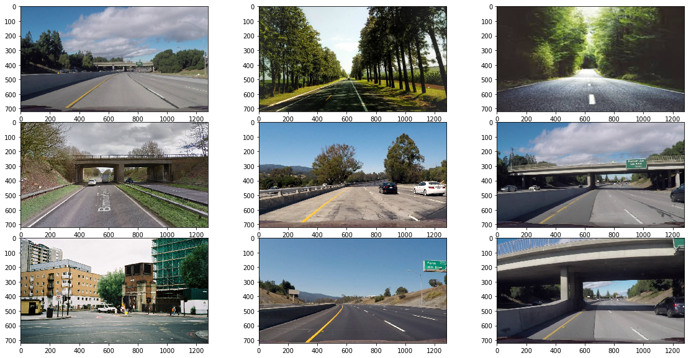


#### Checking out the brighten function 


### brighten

**parameters**

**image:** image or image list

**brightness_coeff** amount of brightness (0<=brightness_coeff<=1), default: random


```python
bright_images= am.brighten(images[0:3]) ## if brightness_coeff is undefined brightness is random in each image
hp.visualize(bright_images, column=3)
```


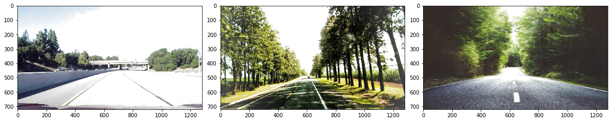


```python
bright_images= am.brighten(images[0:3], brightness_coeff=0.7) ## brightness_coeff is between 0.0 and 1.0
hp.visualize(bright_images, column=3)

```


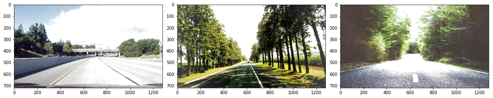


#### Let's darken a few images now

### darken

**parameters**

**image:** image or image list

**darkness_coeff** amount of darkness (0<=darkness_coeff<=1), default: random


```python
dark_images= am.darken(images[0:3]) ## if darkness_coeff is undefined darkness is random in each image
hp.visualize(dark_images, column=3)
```


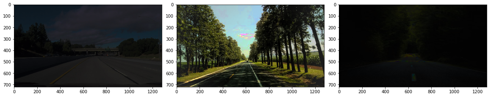


```python
dark_images= am.darken(images[0:3], darkness_coeff=0.7) ## darkness_coeff is between 0.0 and 1.0
hp.visualize(dark_images, column=3)
```


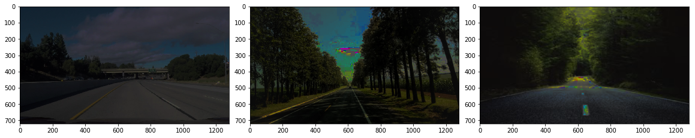


#### But what if you just want some random brightness or darkness in the images. Well try out the random_brightness function which receives an image or an image array


### random_brightness

**parameters**

**image:** image or image list


```python
dark_bright_images= am.random_brightness(images[4:7]) 
hp.visualize(dark_bright_images, column=3)

```


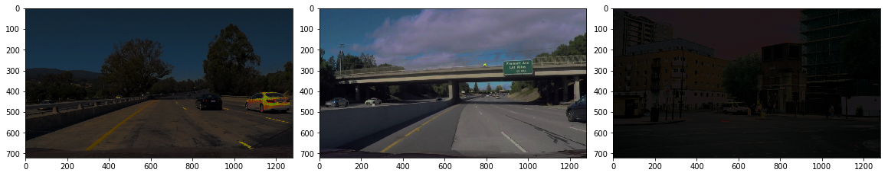


#### What about adding some shadows to the images.

### add_shadow 

**Parameters**

**image:** image or image list

**no_of_shadows:** no. of shadows, **default:** 1

**rectangular_roi:** (top-left x, top-left y, bottom-right x, bottom right y), **default:** lower half of image

**shadow_dimension:** no. of sides of the shadows (3<=shadow_dimension<=10), **default:** random


```python
shadowy_images= am.add_shadow(images[4:7]) 
hp.visualize(shadowy_images, column=3)

```


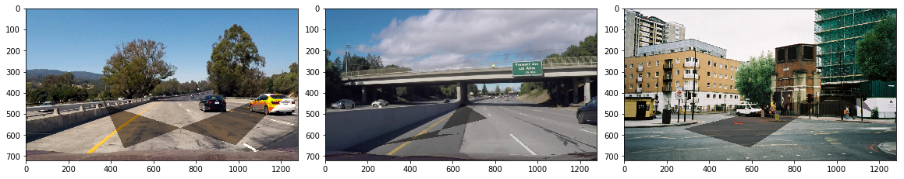


```python
shadowy_images= am.add_shadow(images[4:7], no_of_shadows=2, shadow_dimension=8) 
hp.visualize(shadowy_images, column=3)
```


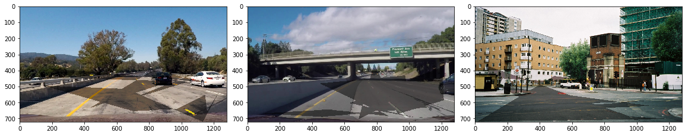


#### Now let's add some snow

### add_snow

**parameters**

**image:** image or image list

**snow_coeff:** amount of snow (0<=snow_coeff<=1), **default:** random


```python
snowy_images= am.add_snow(images[4:7]) ##randomly add snow
hp.visualize(snowy_images, column=3)
```


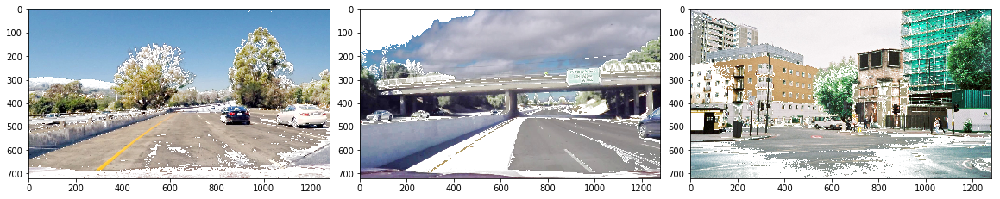


```python
snowy_images= am.add_snow(images[4:7], snow_coeff=0.3) 
hp.visualize(snowy_images, column=3)
```


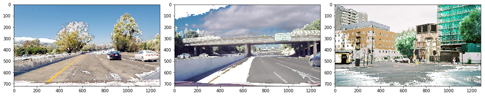


```python
snowy_images= am.add_snow(images[4:7], snow_coeff=0.8) 
hp.visualize(snowy_images, column=3)
```


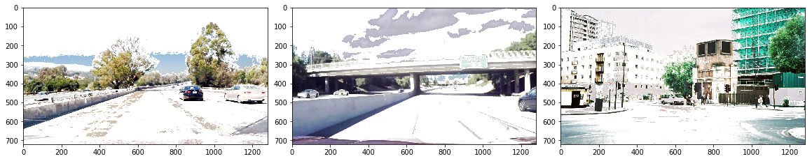


#### and now some rain

### add_rain

**parameters**


**image:** image or image list

**slant:** deviation of rain from normal (-20<=slant<=20), **default:** random

**drop_length:** length of the drop (0<=drop_length<=100), **default:** 20 (pixels)

**drop_width:** width of the drop (1<=drop_width<=5), **default:** 1

**drop_color:** color of droplets, **default:** (200,200,200)

**rain_type:** values in 'drizzle','heavy','torrential', **default:** 'None'


```python
rainy_images= am.add_rain(images[4:7]) 
hp.visualize(rainy_images, column=3)
```


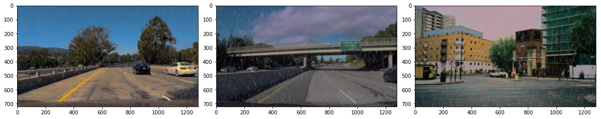


```python
rainy_images= am.add_rain(images[4:7], rain_type='heavy', slant=20) 
hp.visualize(rainy_images, column=3)
```


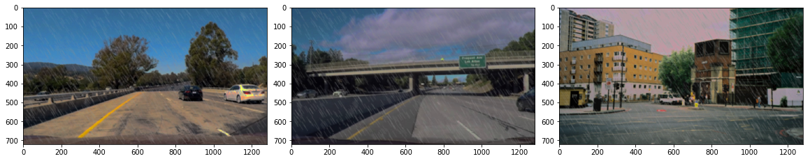


```python
rainy_images= am.add_rain(images[4:7], rain_type='torrential') 
hp.visualize(rainy_images, column=3)
```


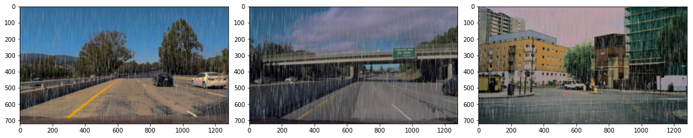


**Note:** drop_length and drop_width values are overriden when rain_type is not None

### add_fog

**parameters**

**image**: image or image list

**fog_coeff:** amount of fog (0<=fog_coeff<=1), **default:** random


```python
foggy_images= am.add_fog(images[4:7]) 
hp.visualize(foggy_images, column=3)
```


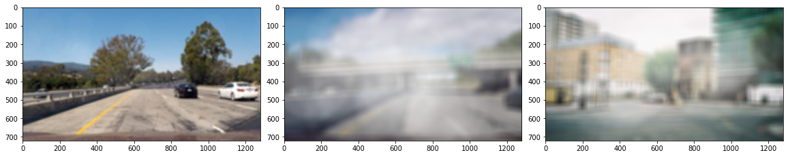


```python
foggy_images= am.add_fog(images[4:7], fog_coeff=0.4) 
hp.visualize(foggy_images, column=3)
```


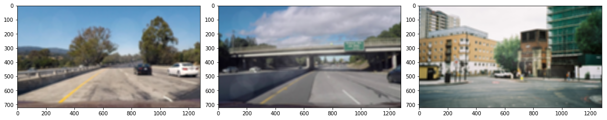


```python
foggy_images= am.add_fog(images[4:7], fog_coeff=0.9) 
hp.visualize(foggy_images, column=3)
```


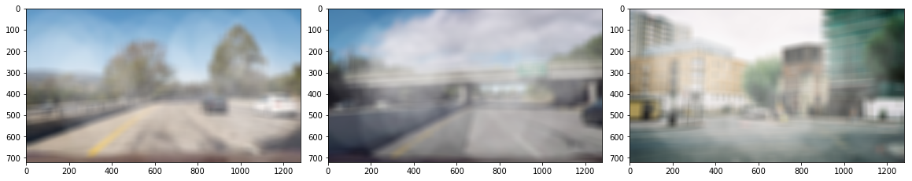


#### what about some gravels on the road now ?

### add_gravel

**parameters**

**image:** image or image list

**rectangular_roi:** (top-left x, top-left y, bottom-right x, bottom right y), **default:** lower 3/4th of image

**no_of_patches:** no. of gravel patches required, **default:** 8


```python
bad_road_images= am.add_gravel(images[4:7]) 
hp.visualize(bad_road_images, column=3)
```


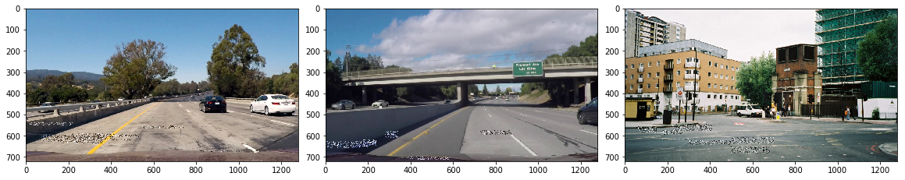


```python
bad_road_images= am.add_gravel(images[4:7], rectangular_roi=(700,550,1280,720),no_of_patches=20) ##too much gravels on right
hp.visualize(bad_road_images, column=3)
```


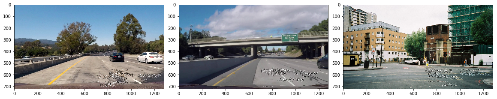


### add_sun_flare

**parameters**

**image:** image or image list

**flare_center:** center coordinates (x,y) of the source, **default:** random

**angle:** angle of flare in randians, **default:** random

**no_of_flare_circles:** no. of secondary flare circles (0<=no_of_flare_circles<=20), **default:** 8 

**src_radius:** radius of the primary flare source, **default:** 400 (pixels)

**src_color:** rgb color of the flare source and secondary circles, **default:** (255,255,255)) 


```python
flare_images= am.add_sun_flare(images[4:7]) 
hp.visualize(flare_images, column=3)
```


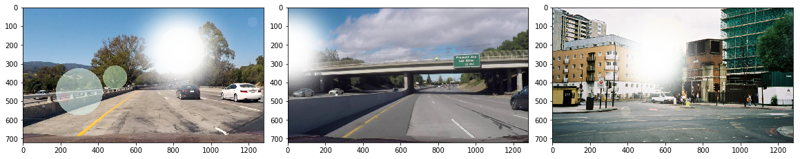


```python
import math
flare_images= am.add_sun_flare(images[4:7], flare_center=(100,100), angle=-math.pi/4) ## fixed src center
hp.visualize(flare_images, column=3)
```


### add_speed

**parameters**

**image:** image or image list

**speed_coeff:** amount of speed (0<=speed_coeff<=1), default: random


```python
speedy_images= am.add_speed(images[1:4]) ##random speed
hp.visualize(speedy_images, column=3)
```


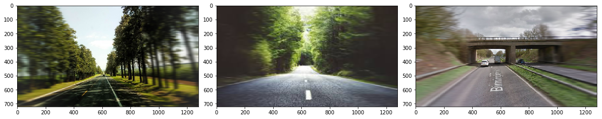


```python
speedy_images= am.add_speed(images[1:4], speed_coeff=0.9) ##random speed
hp.visualize(speedy_images, column=3)
```


### add_autumn

**parameters**

**image:** image or image list


```python
fall_images= am.add_autumn(images[0:3]) 
hp.visualize(fall_images, column=3)
```


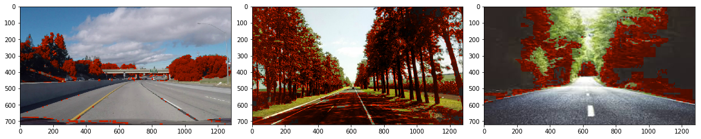


### fliph 

**parameters**

**image:** image or image list


```python
flipped_images= am.fliph(images[0:3]) 
hp.visualize(flipped_images, column=3)
```


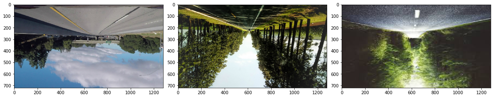


### flipv 

**parameters**

**image:** image or image list


```python
flipped_images= am.flipv(images[0:3]) 
hp.visualize(flipped_images, column=3)
```


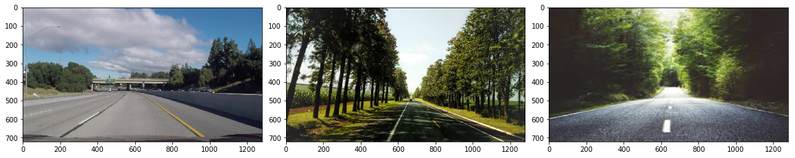


### random_flip

**parameters**

**image:** image or image list


```python
flipped_images= am.random_flip(images[0:3]) 
hp.visualize(flipped_images, column=3)
```


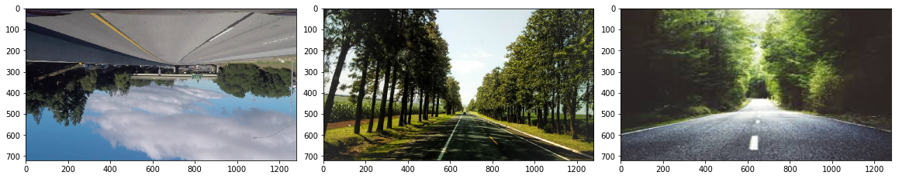


### add_manhole

**parameters**

**image:** image or image list

**center:** center of the ellipse (x,y), default: bottom center of the image

**color:** rgb tuple, default: if type parameter not defined: (67,70,75), else: default color mentioned in type.

**height:** vertical dimension of the hole, int , default: 25th portion of the image height.

**width:** horizontal dimension of the hole, int, default: 3/25th portion of the image height.

**type:** values in 'closed','open', default: 'closed'


```python
manhole_images= am.add_manhole(images[0:3]) 
hp.visualize(manhole_images, column=3)
```


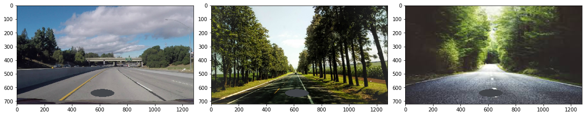


### correct_exposure

**parameters**

**image:** image or image list


```python
exposure_images= am.correct_exposure(images[0:3]) 
hp.visualize(exposure_images, column=3)
```


#### If a series of augmentations is required from above types augment_random function can be handy

### augment_random

**image:** image or image list

**aug_types:** list of Automold functions, eg: ['add_snow','add_rain'], **default:** all aug functions are executed

**volume:** 'same' or 'expand', **default:** expand

            same: keeps the volume of corpus unchanged, applies random aug_types on images

            expand: applies all aug_types on all images and expands output corpus


```python
aug_images= am.augment_random(images[4:6], volume='same')  ##2 random augmentations applied on both images
hp.visualize(aug_images,column=3,fig_size=(20,20))
```


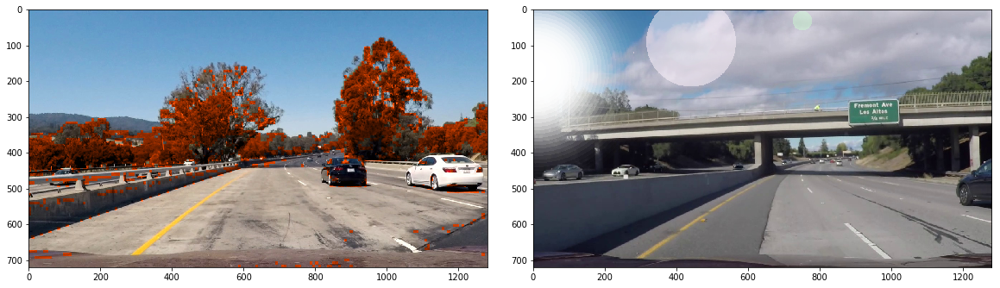


```python
aug_images= am.augment_random(images[4:6], volume='expand')  ##all aug_types are applied in both images
hp.visualize(aug_images,column=3,fig_size=(20,20))
```


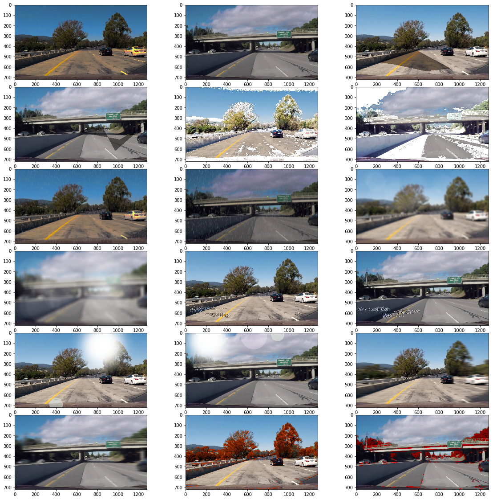


```python
aug_images= am.augment_random(images[4:6], aug_types=['add_sun_flare','add_speed','add_autumn'], volume='expand')  ##all aug_types are applied in both images
hp.visualize(aug_images,column=3,fig_size=(20,10))
```


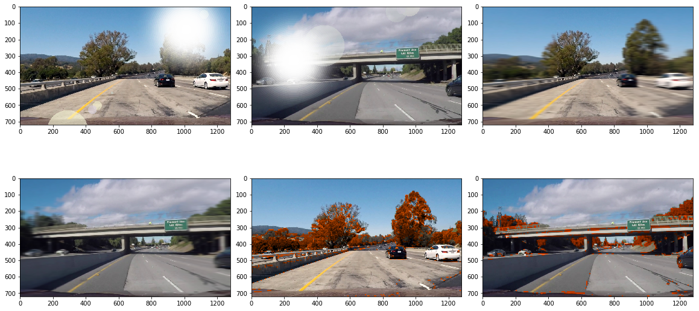


```python
aug_images= am.augment_random(images[4:6], aug_types=['add_sun_flare','add_speed','add_autumn'], volume='same')  ##2 random aug_types are applied in both images
hp.visualize(aug_images,column=3,fig_size=(20,10))
```


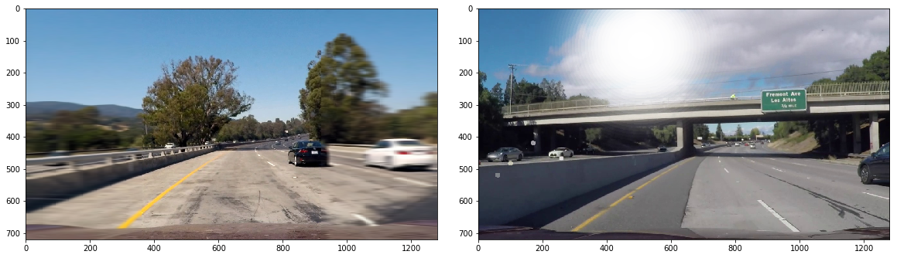


#### Performance statistics


```python
aug_types=["random_brightness","add_shadow","add_snow","add_rain","add_fog","add_gravel","add_sun_flare","add_speed","add_autumn","random_flip","add_manhole"]
dict_time={}
import time
for aug_type in aug_types:
    t=time.time()
    command='am.'+aug_type+'(images)'
    result=eval(command)
    dict_time[aug_type]=time.time()-t
    t=time.time()
print('Average Time taken per augmentaion function to process 1 image:')
tot=0
for key, value in dict_time.items():
    tot+=value
    print(key, '{0:.2f}s'.format(value/len(images)))

print('-----------------------')
print('Total no. of augmented images created:', len(aug_types)*len(images))
print('-----------------------')
print('Total time taken to create ',len(aug_types)*len(images),' augmented images:', '{0:.2f}s'.format(tot))
```

            Average Time taken per augmentaion function to process 1 image:
            add_rain 0.02s
            add_sun_flare 0.09s
            add_fog 0.37s
            add_speed 0.20s
            random_brightness 0.05s
            add_shadow 0.01s
            random_flip 0.00s
            add_manhole 0.01s
            add_autumn 0.31s
            add_gravel 0.04s
            add_snow 0.06s
            -----------------------
            Total no. of augmented images created: 99
            -----------------------
            Total time taken to create  99  augmented images: 10.42s

    

**Note:** The load_images helper function resizes all images to 1280x720 and thus all returned images have the same dimensions. If original image dimensions are required please write a new load function

Some more helpful functions are in pipeline and will get added to the library asap.
Thanx


-------------------------------------------------------------------------------------------------------------------------

MIT License

Copyright (c) 2018 Ujjwal Saxena

Permission is hereby granted, free of charge, to any person obtaining a copy
of this software and associated documentation files (the "Software"), to deal
in the Software without restriction, including without limitation the rights
to use, copy, modify, merge, publish, distribute, sublicense, and/or sell
copies of the Software, and to permit persons to whom the Software is
furnished to do so, subject to the following conditions:

The above copyright notice and this permission notice shall be included in all
copies or substantial portions of the Software.

THE SOFTWARE IS PROVIDED "AS IS", WITHOUT WARRANTY OF ANY KIND, EXPRESS OR
IMPLIED, INCLUDING BUT NOT LIMITED TO THE WARRANTIES OF MERCHANTABILITY,
FITNESS FOR A PARTICULAR PURPOSE AND NONINFRINGEMENT. IN NO EVENT SHALL THE
AUTHORS OR COPYRIGHT HOLDERS BE LIABLE FOR ANY CLAIM, DAMAGES OR OTHER
LIABILITY, WHETHER IN AN ACTION OF CONTRACT, TORT OR OTHERWISE, ARISING FROM,
OUT OF OR IN CONNECTION WITH THE SOFTWARE OR THE USE OR OTHER DEALINGS IN THE
SOFTWARE.
